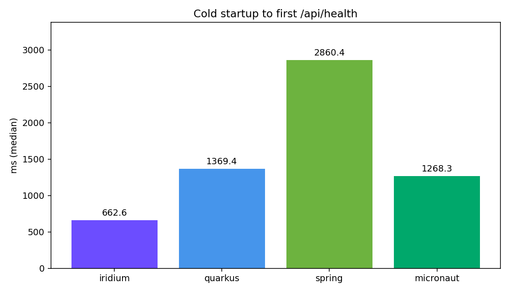
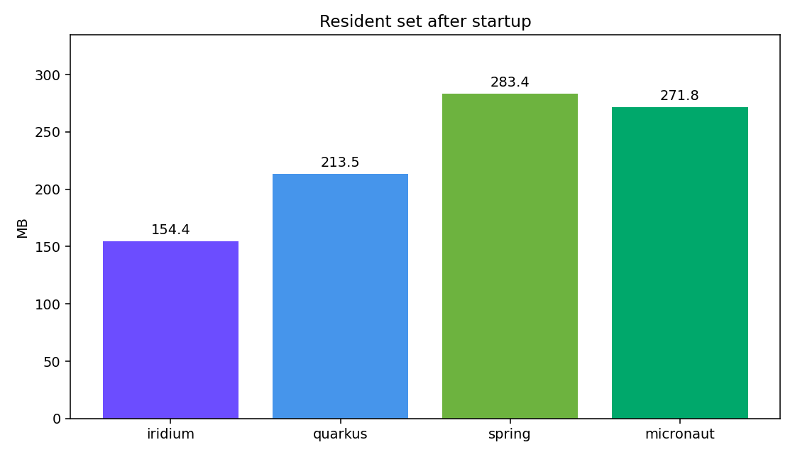
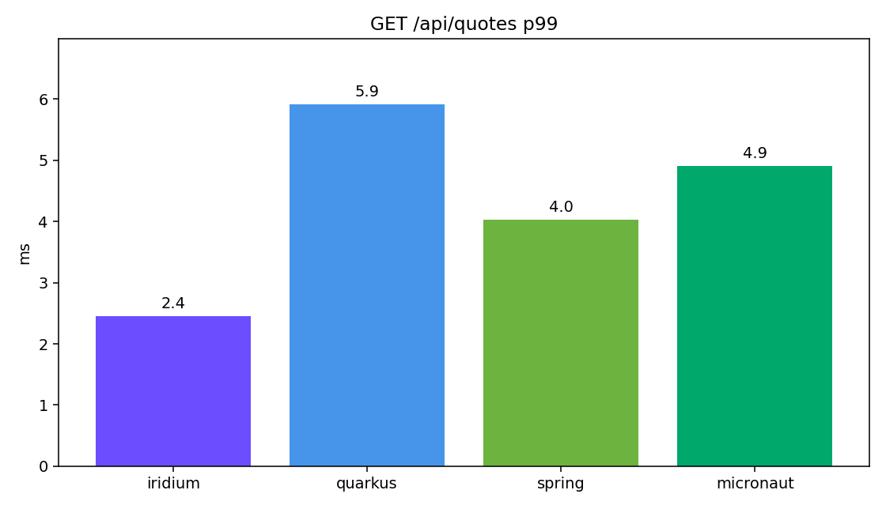
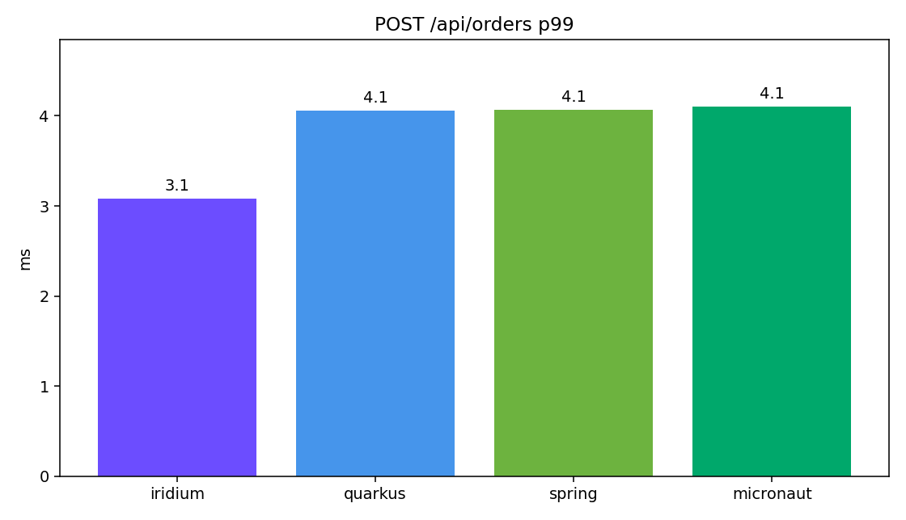
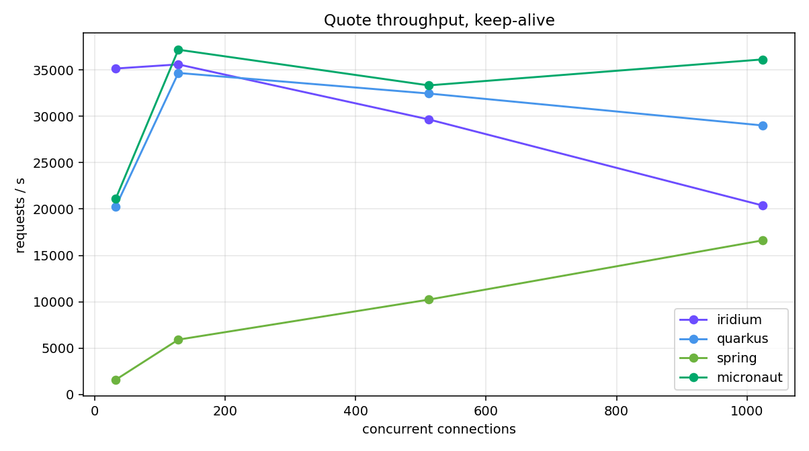
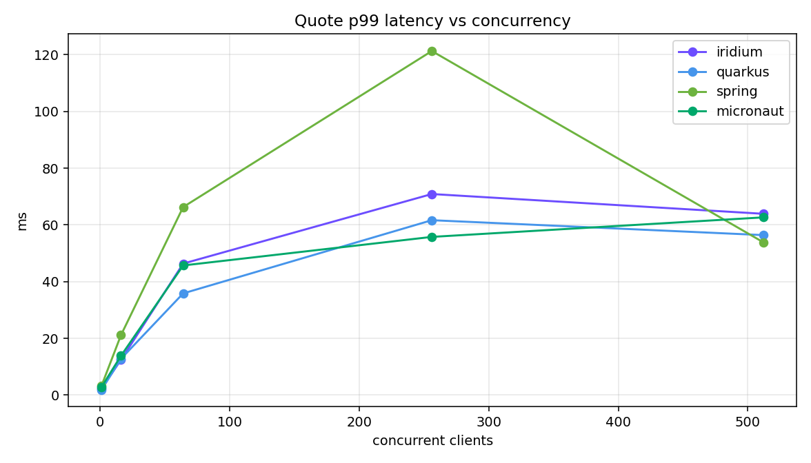

<div align="center">
  
</div>

<br>

# Iridium
Hardwired Java. Full-stack framework built to endure and work in every environment. Zero Reflection. Zero Guesswork.
<br>
Inspired by Spring Boot. Built to stay small.

## Getting started

```kotlin
plugins {
    id("cc.asylum.iridium")
}

application {
    mainClass = "example.Application"
}
```

```java
@WebApplication
public final class Application {

    public static void main(final String[] args) {
        Iridium.run(Application.class, args);
    }
}
```

```java
@RestController
public final class HelloController {

    @GET("/hello")
    public Response<?> hello(@RequestParam(defaultValue = "world") final String name) {
        return Response.ok("Hello, " + name + "!");
    }
}
```

```bash
./gradlew run
```

## Features

- Compile-time dependency injection (`@Component`)
- Configuration binding (`@ConfigurationProperties`, `@Value`) from `application.yml` and `application.properties`
- Annotation-based HTTP routing (`@RestController`, `@GET`, `@POST`, …)
- Request binding (`@PathVariable`, `@RequestParam`, `@RequestBody`, …)
- Bean Validation–style constraints, generated
- Pluggable HTTP server
- Gradle plugin that wires processors, the default stack, and a fat JAR
- Hot Reloading

Default stack: Undertow + Avaje Jsonb. Swap in another server by depending on a different extension.

## Hot Reloading

```gradle

dependencies {
    runtimeOnly project(':iridium-hot-reloading')
}

tasks.named('run') {
    def agent = project(':iridium-hot-reloading').tasks.named('jar')
    dependsOn agent
    jvmArgs "-javaagent:${agent.get().archiveFile.get().asFile.absolutePath}"
}

```

## Benchmarks

Same app, four frameworks: a crypto exchange API with 70 services, constructor injection, config binding, bean validation, and JSON. Endpoints: `GET /api/health`, `GET /api/quotes/{symbol}`, `GET /api/books/{symbol}`, `POST /api/orders`.

Measured on Java 25, `-Xms64m -Xmx256m`, Linux, 12 cores. Startup is the median of 5 cold starts until the first `200` from `/api/health`. Latency is single-connection. Throughput is keep-alive `GET /api/quotes/BTC-USD` for 4 seconds per concurrency level. Not a lab bench: the machine was under other load.

| | startup | RSS | quote p99 | order p99 | peak req/s |
|---|---:|---:|---:|---:|---:|
| Iridium | 663 ms | 154 MB | 2.4 ms | 3.1 ms | 35.6k |
| Quarkus 3.27 | 1369 ms | 214 MB | 5.9 ms | 4.1 ms | 34.7k |
| Spring Boot 3.5 | 2860 ms | 283 MB | 4.0 ms | 4.1 ms | 16.6k |
| Micronaut 4.9 | 1268 ms | 272 MB | 4.9 ms | 4.1 ms | 37.2k |

Peak is the best of 32 / 128 / 512 / 1024 concurrent connections.













### Setup

Iridium on Undertow + Avaje Jsonb. The other three on their default Netty/Tomcat stacks with Jackson.

```bash
java -XX:+UseParallelGC -Xms64m -Xmx256m -jar iridium-demo-exchange.jar          # :18081
java -XX:+UseParallelGC -Xms64m -Xmx256m -jar quarkus-app/quarkus-run.jar        # :18082
java -XX:+UseParallelGC -Xms64m -Xmx256m -jar spring-demo-exchange.jar           # :18083
java -XX:+UseParallelGC -Xms64m -Xmx256m -jar micronaut-demo-exchange-all.jar    # :18084
```

Startup: process start to the first successful `GET /api/health`, five runs, median. RSS from `/proc/<pid>/status` after that response.

Load: keep-alive `GET /api/quotes/BTC-USD?venue=bench`, 4 seconds, concurrency 32, 128, 512, and 1024. Single-connection p99 is a separate serial pass over quote, book, and order. The urllib pass without keep-alive saturates the client near 3k req/s and is not the peak column.

Versions: Quarkus 3.27.0, Spring Boot 3.5.6, Micronaut 4.9.4. Iridium is this repository.

## Requirements

- Java 25
- Gradle 9

## License

Licensed under the [Apache License 2.0](LICENSE.txt).
